## CVDS - LAB02
### Julian Santiago Cárdenas Cubaque
### Sebastian Galvis Briceño


## La herramienta Maven

### - Cual es su mayor utilidad: 
Es una herramienta utlizada para la creacion y desarrollo de proyectos con una definicion 
limpia y facil de entender para todo el desarrolladores. Generando un estandar para la presentacion
estandar y optima de proyectos

### - Fases de Maven:
Las fases de Maven son las etapas secuenciales en el ciclo de vida de construcción de un proyecto. Maven organiza el proceso de construcción en fases, donde cada fase realiza una tarea específica y se ejecuta en un orden determinado. Las fases se agrupan en diferentes ciclos de vida, siendo el ciclo de vida predeterminado el más común y utilizado.

### - Ciclo de vida de la construcción:
El ciclo de vida de la construcción son las fases del proceso que sigue Maven para construir, probar, empaquetar y desplegar una aplicación.
Hay tres ciclos de vida principales en Maven:
- Ciclo de vida de la construcción predeterminado (default).
- Ciclo de vida de limpieza (clean).
- Ciclo de vida de implementación (site).

Explicaremos el ciclo de vida de la construcción predeterminado.

**1. Validar:**
Esta fase verifica que el proyecto esté correctamente configurado y que todos los parámetros y dependencias necesarias estén presentes. Si falta algún elemento esencial, Maven generará un error.

_Ejemplo: Si en el archivo pom.xml se tienen dependencias que no existen o están mal configuradas, Maven avisará durante esta fase._

**2. Compilar:**
En esta fase, el código fuente del proyecto (normalmente en el directorio src/main/java) se compila y se transforma en archivos .class (archivos bytecode de Java).

_Ejemplo: Si se tiene una clase llamada MiClase.java, Maven la compilará para generar MiClase.class._

**3. Probar:**
Una vez que el código ha sido compilado, Maven ejecuta las pruebas unitarias que estén definidas en el proyecto (por ejemplo, usando JUnit). Esta fase asegura que el código funciona correctamente y cumple con los requisitos de calidad.

_Ejemplo: Si se tienen pruebas unitarias en la carpeta src/test/java, Maven las ejecutará durante esta fase._

**4. Empaquetar:**
Esta fase empaqueta el código compilado en un formato adecuado para su distribución. El tipo de empaquetado dependerá de la configuración del proyecto (por ejemplo, un .jar, .war, .ear, etc.).

_Ejemplo: Si el proyecto es una aplicación Java, Maven generará un archivo myapp.jar durante esta fase._

**5. Verificar:** 
En esta fase se realiza una verificación adicional para asegurarse de que el proyecto ha sido correctamente empaquetado y que cumple con todos los requisitos antes de continuar.

_Ejemplo: Si el proyecto tiene configuraciones adicionales o un perfil específico para la verificación, Maven lo comprobará en esta fase._

**6. Instalar:**
Durante esta fase, Maven instala el artefacto (por ejemplo, el archivo .jar, .war, etc.) en el repositorio local de Maven (en la máquina de desarrollo) para que pueda ser utilizado por otros proyectos que dependan de él.

_Ejemplo: Si el proyecto genera un archivo .jar, Maven lo copiará al repositorio local en el directorio .m2/repository._

**7. Desplegar:**
En esta fase, Maven despliega el artefacto empaquetado en un repositorio remoto, como un repositorio de Maven central o un repositorio privado. Este paso es utilizado generalmente en entornos de integración continua y producción.

_Ejemplo: El archivo .jar que se ha generado se sube a un servidor de repositorios como Nexus o Artifactory._

**Flujo de ejecución:**
Maven sigue estas fases en un flujo de ejecución secuencial. Si se ejecuta una fase intermedia, como compile, Maven ejecutará automáticamente todas las fases anteriores (por ejemplo, validate). 

Por ejemplo, si se ejecuta:
```bash
mvn clean install
```

1. Ejecutará el ciclo de vida clean, eliminando los archivos generados anteriormente (como los .class).
2. Luego ejecutará el ciclo de vida default, que incluirá todas las fases desde validate, compile, test, package, verify hasta install.

### - ¿Para qué sirven los plugins?
Los plugins en Maven son componentes que permiten ampliar y personalizar las funcionalidades del ciclo de vida de la construcción. En otras palabras, los plugins en Maven realizan tareas específicas en cada fase del ciclo de vida del proyecto, como compilar el código, ejecutar pruebas, empaquetar el artefacto, generar documentación, entre otras. Sin plugins, Maven no sería tan flexible y eficiente, ya que los plugins permiten automatizar y personalizar una gran cantidad de tareas.

Los plugins se configuran en el archivo _pom.xml_ del proyecto. En este archivo, se puede definir qué plugins se quieren usar, qué fases del ciclo de vida del proyecto ejecutan y qué configuraciones específicas requieren esos plugins.

### - Que es y para que sirve el repositorio central de Maven
Es un repositorio publico que contiene una gran cantidad de bibliotecas y plugins que como desarrolladores podemos utilizar dentro de los proyectos.
Sirve como una central de dependencias , facilitando la gestion y el acceso a las bibliotecas para el desarrollo de proyectos.


## EJERCICIO DE LAS FIGURAS
### CREACION DLE PROYECTO MAVEN

Para la creacion del proyecto en primer lugar nos ubicamos en la ruta de ubicacion del proyecto desde
la consola de comandos usando 

```git
  cd "ruta"
```

Posteriormente, teniendo en cuenta las indicaciones dadas,usamos la siguiente linea de codigo para generar el proyecto Maven

```
mvn archetype:generate -DgroupId=edu.eci.cvds -DartifactId=Patterns -DarchetypeGroupId=org.apache.maven.archetypes -DarchetypeArtifactId=maven-archetype-quickstart -DarchetypeVersion=1.0 -Dpackage=edu.eci.cvds.patterns.archetype
```

Este codigo puede entenderse de la siguiente manera:
  - mvn : Comando Principal para ejecutar maven desde la consola
  - archetype:generate: Se genera un nuevo proyecto usando un arquetipo
  - -DgroupId= edu.eci.cvds: Se define el groupId del proyecto
  - -DartifactId=Patterns: Se define el nombre del proyecto que se esta creando 
  - -DarchetypeGroupId=org.apache.maven.archetypes : Se esta especificando el grupo del arquetipo que se va a utilizar
  - -DarchetypeArtifactId=maven-archetype-quickstart: Se especifica el ArtifactId, es decir el nombre del arquetipo utilizado
  - -DarchetypeVersion=1.0: Se define la version del arquetipo
  - -Dpackage=edu.eci.cvds.patterns.archetype: Define el paquete base de las clases generadas
  - -DinteractiveMode=false: Se esta indicando a Maven que utilice paquetes predeterminados.


## Ajustar algunas configuraciones en el proyecto
Cambiar la version del compilador de Java a la versión 8 no ofreció ningún problema.
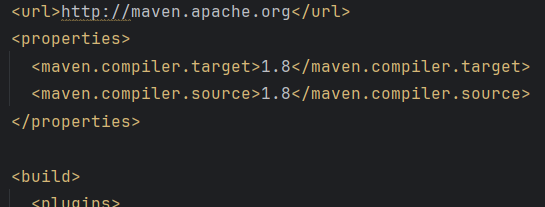


## Compilar y ejecutar

### - ¿Cuál es el objetivo del parámetro "package"?
Cuando se especifica la fase package en un comando de Maven, se le está indicando a Maven que ejecute todas las fases previas del ciclo de vida de construcción hasta llegar a la fase de empaquetado. El objetivo de la fase package es empaquetar el código compilado en un formato adecuado (como un archivo .jar, .war, .ear, etc.) para que el proyecto esté listo para su distribución o despliegue.

El propósito principal de la fase package es:
- Crear el artefacto del proyecto, como un archivo .jar, .war, .ear, dependiendo del tipo de proyecto.
- Este artefacto es el archivo que generalmente se distribuye o se sube a un repositorio para su uso en otros proyectos.
- En esta fase, Maven empaqueta el código compilado, los recursos y otros archivos necesarios en el archivo final que se usará para ejecutar la aplicación o para compartirla con otros desarrolladores.

### - ¿Qué otros parámetros se podrían enviar al comando mvn?
Al comando mvn pueden agregarse los parámetros:
- Clean: Limpia los archivos generados por construcciones anteriores, eliminando el directorio target/ donde se almacenan los artefactos generados. Esto se hace para asegurar que la construcción sea completamente nueva.
- Install:  Se usa para instalar el artefacto en el repositorio local de Maven (~/.m2/repository), de modo que pueda ser usado por otros proyectos que lo necesiten como dependencia.
- Clean install: Esta combinación de comandos limpia el proyecto y luego lo vuelve a construir e instala en el repositorio local.
- -D: Permite definir propiedades del sistema o parámetros de configuración específicos para la construcción. Por ejemplo, se puede especificar una versión de Java, una configuración personalizada o una propiedad del proyecto.
- -X: Activa el modo de depuración y muestra información detallada sobre el proceso de construcción. Es útil para investigar problemas complejos.
- -e: Maven mostrará información más detallada sobre los errores que ocurran durante el proceso de construcción, lo cual es útil para depurar problemas.
- -P: Permite activar un perfil específico definido en el archivo pom.xml. Los perfiles en Maven se utilizan para tener configuraciones diferentes según el entorno (por ejemplo, uno para desarrollo y otro para producción).
- -q: Activa el modo silencioso y suprime la salida de Maven, mostrando solo los mensajes importantes o errores.
- -U: Maven actualizará las dependencias del proyecto desde los repositorios remotos, incluso si las dependencias ya están presentes en el repositorio local.
- Site: Genera la documentación del proyecto, como el informe de las pruebas, dependencias, cobertura de código, etc., y la guarda en el directorio.
- -DskipTests: Salta la ejecución de las pruebas durante la construcción, pero aún así empaqueta los artefactos. Es útil cuando solo se desea compilar y empaquetar sin ejecutar las pruebas unitarias.

### Ejecución:
Para ejecutar desde línea de comandos un proyecto maven, abrimos una pestaña del command prompt y escribiremos:
```bash
mvn exec:java
```
Previo a esto para realizar la ejecucion del codigo debemos modificar el archivo pom.xml, agregando un bloque de codigo que nos permite ejecutar la ruta de ejecucion.
```
<project>
  ...
  <build>
    <plugins>
      <plugin>
        <groupId>org.codehaus.mojo</groupId>
        <artifactId>exec-maven-plugin</artifactId>
        <version>3.5.0</version>
        <executions>
          <execution>
            <goals>
              <goal>java</goal>
            </goals>
          </execution>
        </executions>
        <configuration>
          <mainClass>com.example.Main</mainClass>
          <arguments>
            <argument>argument1</argument>
          </systemProperties>
        </configuration>
      </plugin>
    </plugins>
  </build>
   ...
</project>
```

Y podremos ver el resultado:
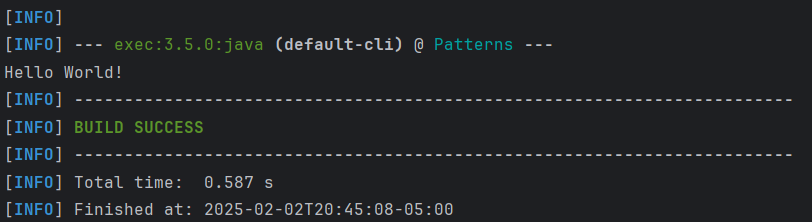

Ahora modificamos la clase para que al recibir un parámetro, lo imprima dentro del saludo:
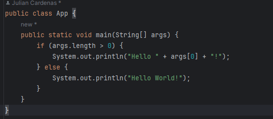

Para poder ejecutarlo, agregamos -Dexec.args al final de la ejecución de la forma:
```bash
mvn exec:java -Dexec.args="Pepito"
```
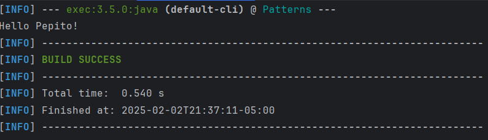

Ahora, para poder ejecutarlo con múltiples parámetros volveremos a modificar la clase de la forma:
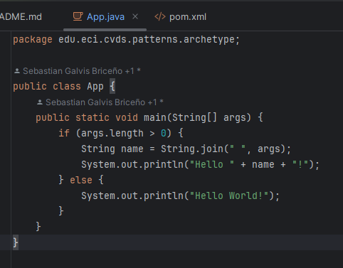

Y lo pondremos a prueba:
```bash
mvn exec:java -Dexec.args="Pepito Perez del Río"
```
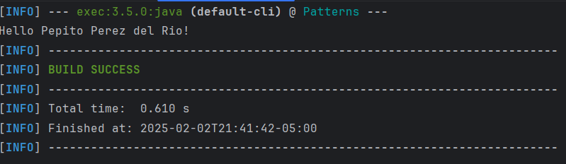


## Hacer el esqueleto de la aplicación

Para del diseño del esqueleto se usara el patron de diseño de fabrica, par esto usaremos los codigos proporcionados para en el laboratorio, lo que consiste en la creacion de una interfaz para
para la creacion de objetos de una superclase, pero permite que las superclases alteren el tipo de obhjetos que se crean. El objetivo principal de este patron de disñeo es facilitar la 
extensibilidad y el mantenimiento.
Algunas de las ventajas del patron de factory son:

1. Permite agreegar nuevas clases de productos sin modificar codigo existente
2. Facilita las pruebas unitarias dado que plantea implementaciones robustas
3. Util en framworks donde se necesita fleibililidad.


Decidimos utilizar _Simple Factory_ debido a su simplicidad y a lo que se necesita hacer en este laboratorio. Para ello, creamos las clases:
- ShapeFactory:

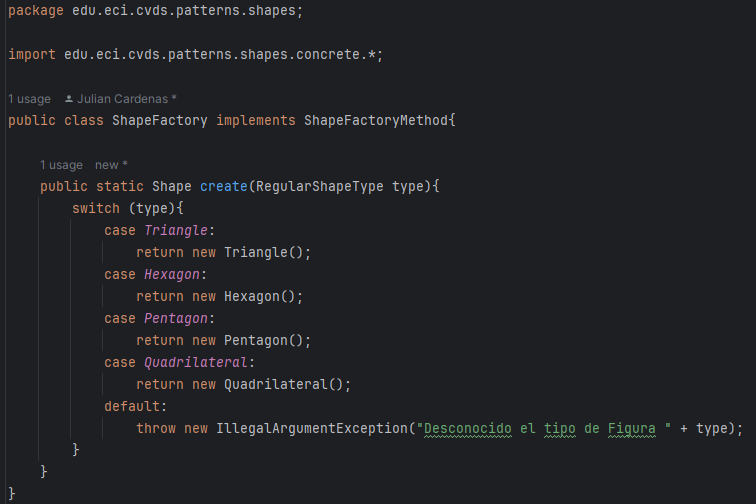
- ShapeFactoryMethod:

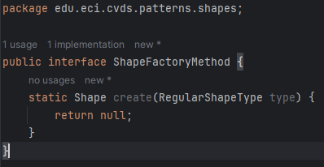
- Shape:

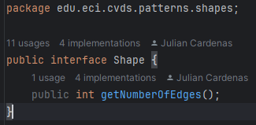

Cambiaremos también la mainClass en el archivo _pom.xml_:
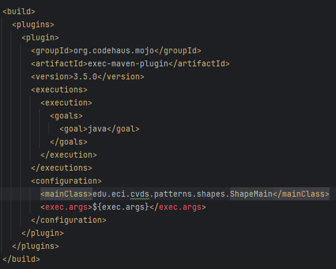

Y, por último, construimos y ejecutamos de la forma:
```bash
mvn clean package
mvn exec:java -Dexec.args="nombreFigura"
```

A continuación, adjuntamos capturas de las cinco posibles ejecuciones:
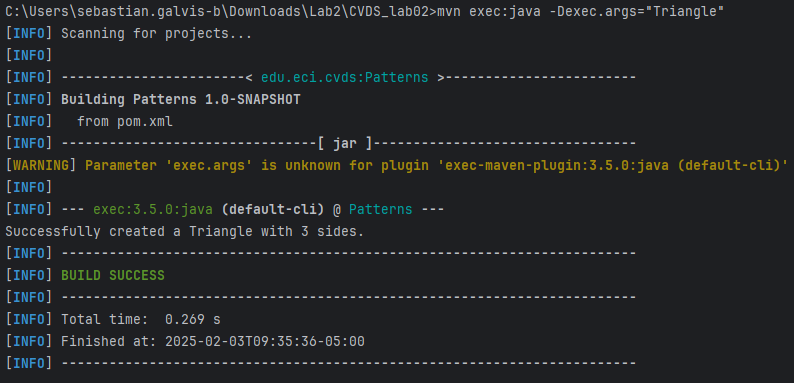
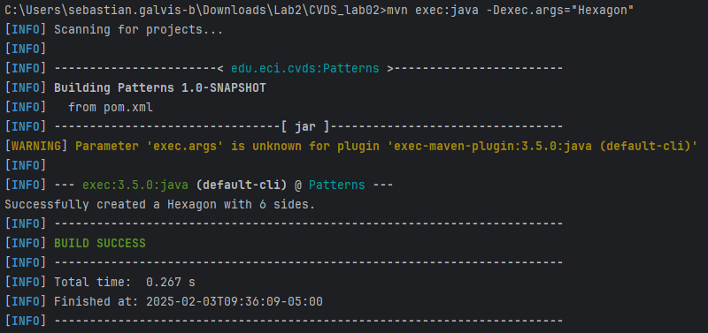
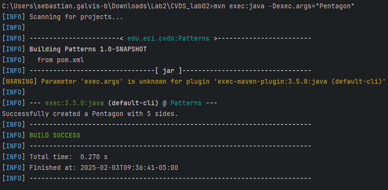
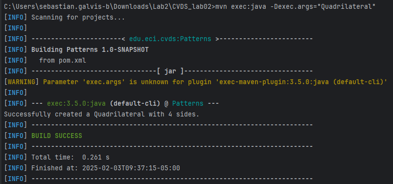
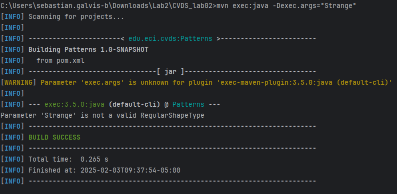
